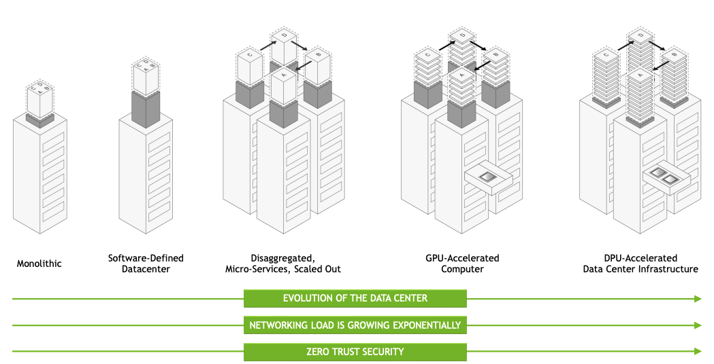
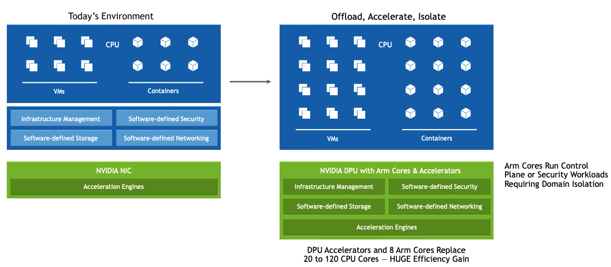
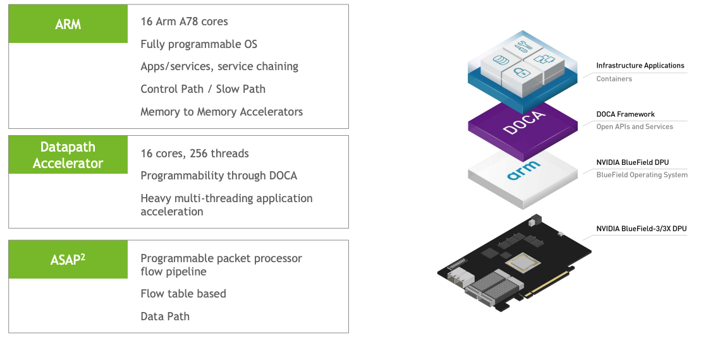
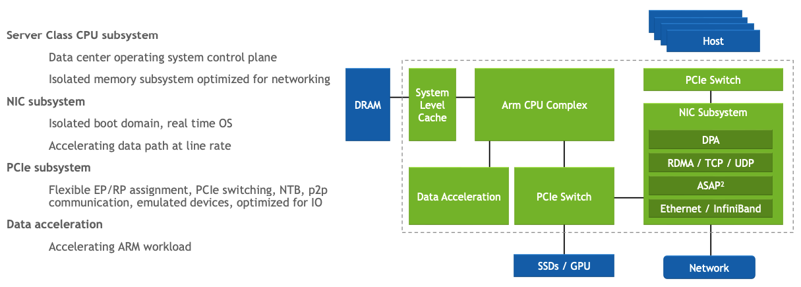
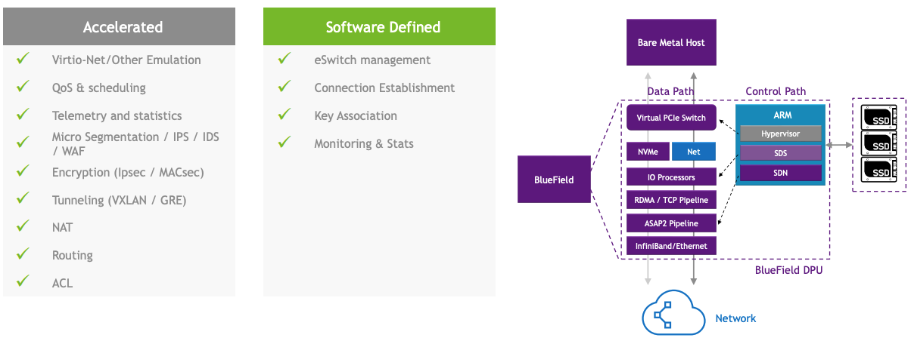
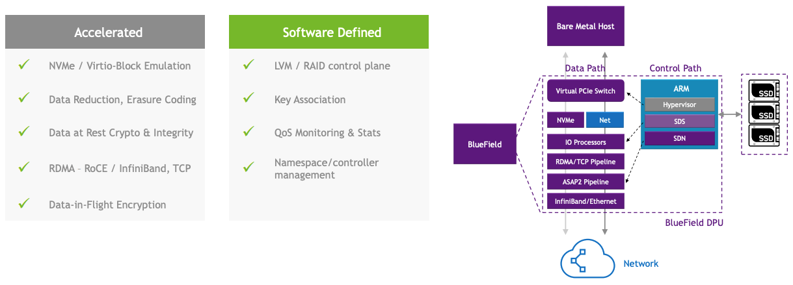
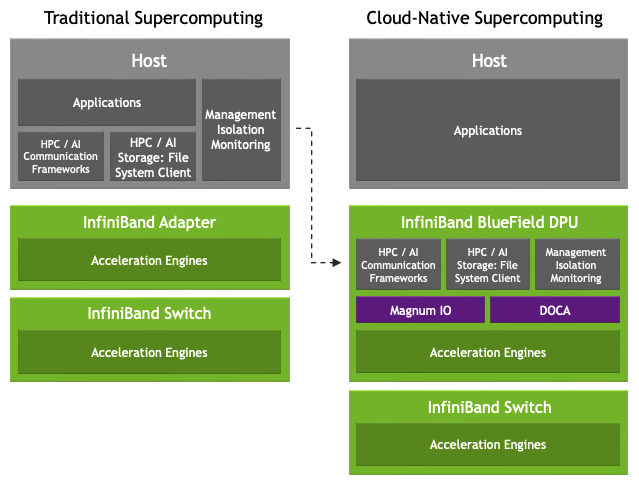
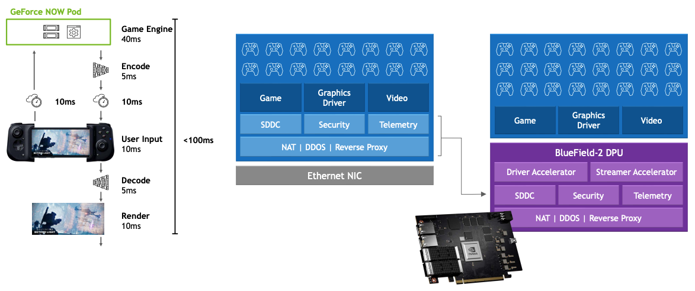
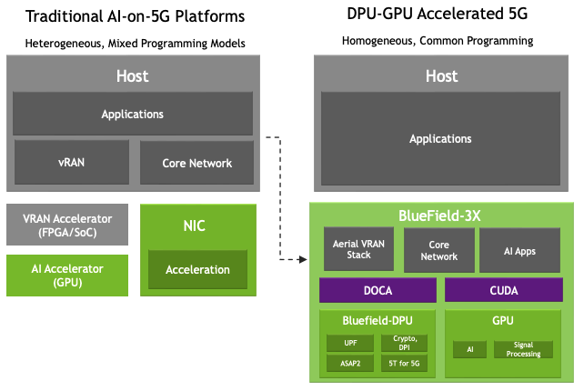

# NVIDIA DATA CENTER PROCESSING UNIT (DPU) ARCHITECTURE

-- This artical partially translated from Original [link](https://hc33.hotchips.org/assets/program/conference/day1/HC2021.NVIDIA.IdanBurstein.v08.norecording.pdf)

## DATA CENTER IS THE NEW UNIT OF COMPUTING

## DPU MUST INCLUDE HARDWARE ACCELERATION

## PROGRAMMABLE ENGINES

DOCA
- Offload, Accelerate, and Isolate Infrastructure Processing
- Support for Hyperscale, Enterprise, Supercomputing and
Hyperconverged Infrastructure
- DOCA is for DPUs what CUDA is for GPUs  

## ARCHITECTURE

### High level arch:

It's subsystems from CPU system.

### ACCELERATED SWITCHING AND PACKET PROCESSING
1. Programmable Data Path
2. Software-Defined Orchestration

### ACCELERATED STORAGE PROCESSING

### Offload
- Offload Cloud-Native Supercomputing

- Offload CLOUD GAMING Supercomputing

- Offload 5G NETWORK PROCESSING 

  
  - Accelerate 5G or AI – Fully fungible – Fully programmable
  - Support for CUDA, DOCA – Toolchains, SDKs, Libraries
  - Secure, Isolated, Accelerated data processing
  - No need to move data back and forth from accelerators to
host memory
  - Domain specific acceleration for 5G, AI, Network Security
  - Independent DPU time domain (5T for 5G)
  - Fully optimized data path
