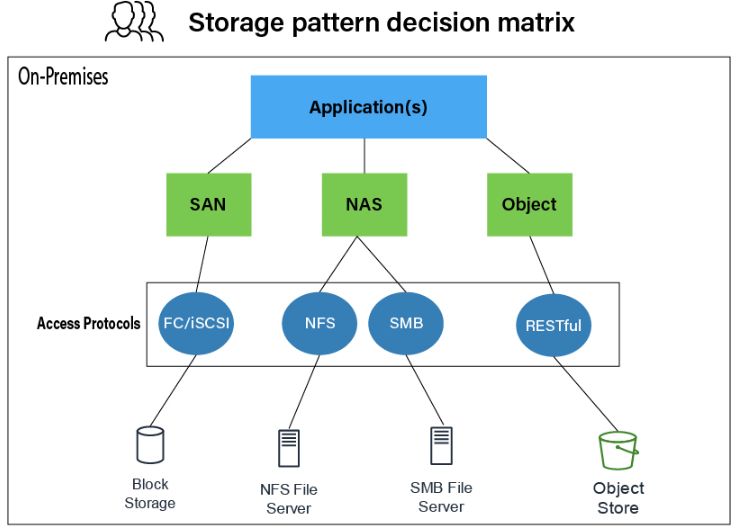

# Overview of Distributed Storage
Distributed storage is a system in which data is stored accross muitiple physical or virtual machines(nodes) but acts as a single, unified storage resource. Its primary goal is to provide high availability, fault tolerance and scalibity by distributing data accross muitiple locations. Distributed storage systems are crutial for handing massive amounts of data efficiently, especially in morden data centers, cloud computing environments, and big data applications.  

## Key Features of Distributed Storage
- Scalibility: Ability to increase storage capacity by adding more nodes without degrading performance.
- Fault tolerance: Uses replication and data integration techinicals to prevent data loss.
- Data durability: Guarantees continuous data access with minimal downtime, even during maintenance of failures.
- Elasticity: Dynamically adjusts resource usage (storage and compute) based on current demand.

## Main Technical Streams of Distributed Storage
1. Object Storage:
    - Key Concept: Data is storaged as objects, each containing the data itself, metadata, and a unique identifier
    - Usage: Ideal for unstructured data like backups, media content, and log files.
    - Example Systems:
        - Amazon S3
        - Minio
        - Ceph(RADOS Gateway)

2. Block Storage:
    - Key Concepts: Data is stored in fixed-size blocks across nodes, resembling traditional disk storage but distributed over multiple servers.
    - Usage: Suitable for databases, virtual machine disks, and other applications that require fast, random access to small chunks of data.
    - Example systems:
        - Amazon EBS(Elastic Block Storage)
        - Ceph(RADOS Block Device - RBD)
        - OpenEBS

3. File Storage(Distributed File Systems):
    - Key Concept: File are split into blocks, called Striping while it also support Distributed Volums without spliting file into blocks, and distributed accross multiple nodes, but users experience it as a traditional file system.
    - Usage: High-performance computing, large-scale file storage like media archives and data sharing in distributed environments.
    - Example Systems:
        - GlusterFS
        - Hadoop Distributed File System
        - CephFS

4. Software-Definied Storage:
    - Key Concept: Decouples the control plane (storage managemnt) from the physical storage hardware, allowing for flexible storage deployment across different hardware and environments.
    - Usage: Provides flexibility, automation, and cost efficiency for managing storage resources in private, hybrid, or public clouds.
    - Example Systems:
        - VMware VSAN
        - Ceph
        - Red Hat Openshift Container Storage

5. Cloud-Native Storage:
    - Key concept: Designed specifically for containerized and cloud-native environments, often integrated with Kubernetes for dynamic, scalable storage.
    - Usage: primarily used in Kubernetes Clousters for microservices, statful applications, and DevOps. Not that commonly used in production envoronments

## Main Distributed Storage Products and Scenarios
1. Amazon S3 (Object Storage):
    - Use Case: Cloud-native applications, media hosting, backups, bit data analysis.
    - Scenario: Scalable storage for unstructured data, especially in public clouds.
2. Ceph (Unified Storage - Object, Block, File storage)
    - Use Case: Enterprise-grade cloud and storage solutions (private and public cloud), big data, virtualization storage for VMs and containers.
    - Scenario: Private cloud deployments like OpenStack or Kubernetes, providing a unified platform for various types of storage needs.
3. GlusterFS (File Storage):
    - Use Case: Media streaming, content distribution, and high-performance computing(HPC)
    - Scenario: Storing large media files, archives, or high-throughput workloads that need horizontal scalibility.
4. VMware vSAN (Software defined storage)
    - Use Case: Hyper-converged infrastructure, virtual machine storage.
    - Scenario: Enterprises that use VMware's ecosystme for managing virtual machines and need integrated storage solutions.
5. MinIO (Object Storage):
    - Use Case: High-performance storage for cloud-native and DevOps workloads.
    - Scenario: Distributed storage in multi-cloud or hybrid cloud environments hwer performance, speed, and scalablity are critical.
6. Google Cloud Storage (Object Storage):
    - Use Case: Backup, data lakes, content delivery.
    - Scenario: Golbally distributed storage with integration into Google's data analytics and machine learning ecosystems.

## Conlution
Distributed storage has evolved into various technical streams, including object/block/file storage, along with software-defined and cloud-native storage. The main goal of these system is to offer flexibility, scalability, and high availability across diverse scenarios like cloud computing, big data, enterprise virtualization, and kubernetes-based microservices.