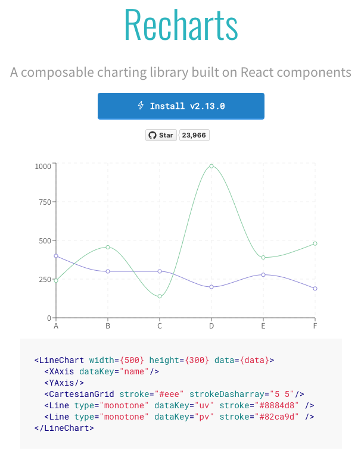

# next.js 

## Radix UI
[Radix UI](https://www.radix-ui.com/themes/docs/overview/getting-started), a Modern Component Library for Accessible Design
Radix UI offers a collection of low-level, accessible React components that help developers build applications with a high degree of customization and maintainability.  
**Key Features of Radix UI**  
1. Accessibility First.
2. Customizable Components.
3. Headless Component Architecture.
4. High-Quality Animation.
5. Optimized for Performance.  

Popular components in Radix UI
- Dialog
- Dropdown Menu
- Popover
- Tabs

Radix UI is ideal for develpers who want to accessible, flexible, and performance-optimized component library without being limited by pre-existing styles, which bring your vision of life.

## Rechart

[Rechart](https://recharts.org/en-US/examples) is a charting library built on React, designed for creating simple, customizable and reponsive charts. It uses SVG for rending, providng an intutive and easy-to-use API, which makes it perfect for quickly building data visualization applications. Recharts is especially suited for front-end developers, as it integrates seamlessly with React projects and supports a variety of chart types, including line/bar/pie charts.  

Recharts is an solid choice for charting library with simple API and flexible customization options, developers can quickly achieve effective data visualizations.
